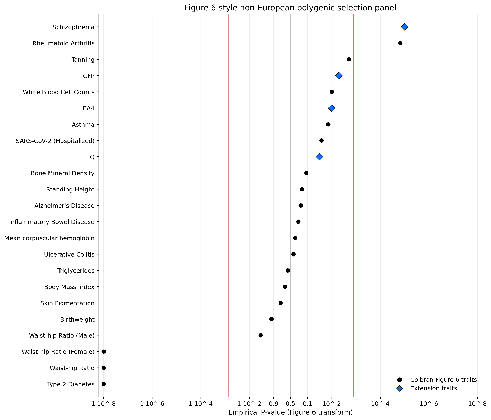
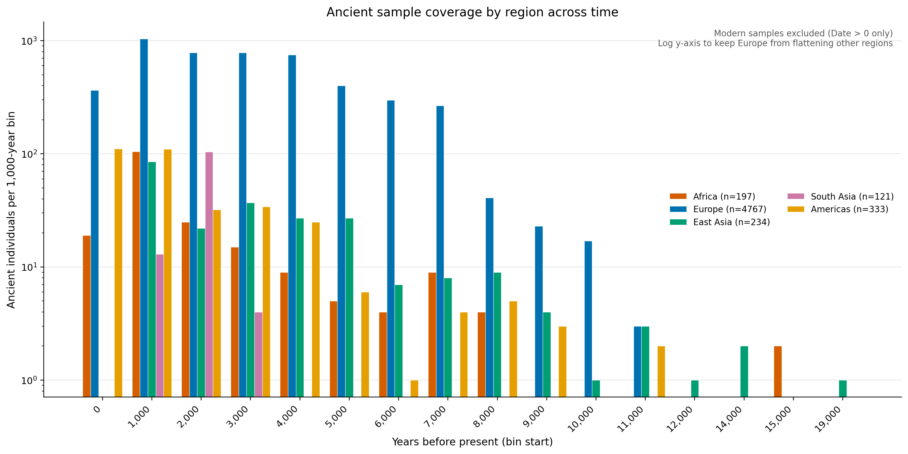

# colbran-polygenic-self-domestication

This repository is a focused extension of Colbran, Terhorst, and Mathieson, *Global patterns of natural selection inferred using ancient DNA*.

The extension asks whether traits frequently discussed in the self-domestication literature, alongside closely related cognitive comparison traits, show the same kind of admixture-aware polygenic selection signal that Colbran et al. evaluated for other complex traits:

- `gfp`: a General Factor of Personality built from Big Five GWAS
- `schizophrenia`: schizophrenia risk from European summary statistics processed under the same downstream pipeline
- `iq`: intelligence from Savage et al. 2018 full summary statistics
- `ea4`: educational attainment from the Lee et al. 2018 lead-hit supplementary table

The motivation is straightforward.
If the Holocene transition were only a story about diet, then a framework like Colbran's should mostly light up diet-linked traits.
Instead, this extension asks whether traits tied to social tolerance, behavioral regulation, psychiatric vulnerability, and general cognitive performance also show signal.
Our reading is that the Holocene transition was not primarily about diet.
It was a broader culture change, in the older sense of *cultura* as cultivation, that selected for different brains as well as different bodies.

## What this repo does

The public runner deliberately follows the polygenic-selection methods in Colbran et al. as closely as possible downstream of trait construction:

- filter to variants present on the `1240k` panel
- keep genome-wide-significant variants with `p < 1e-8`
- clump with PLINK using a `200 kb` window and `r^2 > 0.4`
- orient each locus to the trait-increasing allele
- run the sign-permutation test on `AFR`, `EAS`, `SAS`, `SAM`, and `joint_non_eur`

The only substantive extension is the trait itself for GFP.
Because there is no standard public item-level GFP GWAS, this repository constructs a GWAS-like GFP summary statistic from public Big Five GWAS, reversing neuroticism and combining the five traits with literature-weighted loadings.
That synthetic trait is then passed through the same downstream polygenic-selection pipeline as schizophrenia, IQ, and EA4.
The main defense of this construction is that the final GFP-significant loci are not just one-trait artifacts: among the `163` genome-wide-significant GFP variants on the shared Big Five SNP set, `133` are directionally concordant across all `5/5` Big Five traits and the remaining `30` are concordant across `4/5`.

## Repository layout

- [`scripts/run_extension.py`](scripts/run_extension.py)
  Main entry point.
  Builds GFP, loads schizophrenia hits, matches both to AADR `1240k`, PLINK-clumps them, and runs the sign-permutation test.
- [`scripts/run_cognitive_comparison.py`](scripts/run_cognitive_comparison.py)
  Runs IQ and EA4 through the same public AADR-intersection, PLINK-clumping, and sign-permutation workflow.
- [`scripts/plot_figure6_comparison.py`](scripts/plot_figure6_comparison.py)
  Recreates a Figure 6-style panel with the GFP, schizophrenia, IQ, and EA4 results added to the Colbran non-European trait table.
- [`scripts/plot_ancient_sample_coverage.py`](scripts/plot_ancient_sample_coverage.py)
  Plots the dated ancient-sample coverage by region and millennium to show the temporal lens available to the ancient-DNA model.
- [`polygenic_selection.py`](polygenic_selection.py)
  The sign-only admixture-aware test used by the public runner.
- [`data/colbran_eur_polygenic_table3.tsv`](data/colbran_eur_polygenic_table3.tsv)
  A compact transcription of the nonredundant European-GWAS Figure 6A table used for the comparison plot.
- [`data/sample_info`](data/sample_info)
  Small regional sample-info tables used to recreate the target population panels.

## Results

The repository commits the exact small files needed to inspect the result without rerunning the pipeline:

- [`results/extension_100k/polygenic_summary.tsv`](results/extension_100k/polygenic_summary.tsv)
  Main sign-only summary across `AFR`, `EAS`, `SAS`, `SAM`, and `joint_non_eur`.
- [`results/extension_100k/polygenic_joint_non_eur_sensitivity.tsv`](results/extension_100k/polygenic_joint_non_eur_sensitivity.tsv)
  Sensitivity analysis dropping the more European-like South American sources.
- [`results/extension_100k/candidate_lead_variants.tsv`](results/extension_100k/candidate_lead_variants.tsv)
  Exact pre-clump `1240k` candidate panels for `gfp` and `schizophrenia`.
- [`results/extension_100k/lead_variants.tsv`](results/extension_100k/lead_variants.tsv)
  Exact post-clump lead-locus panels used in the sign test.
- [`results/extension_100k/candidate_match_summary.tsv`](results/extension_100k/candidate_match_summary.tsv)
  Trait-level summary of GWAS hit matching before clumping.
- [`results/extension_100k/lead_variant_match_summary.tsv`](results/extension_100k/lead_variant_match_summary.tsv)
  Trait-level summary of the final clumped panels.
- [`results/cognitive_comparison_100k/polygenic_summary.tsv`](results/cognitive_comparison_100k/polygenic_summary.tsv)
  Main sign-only summary for `iq` and `ea4`.
- [`results/cognitive_comparison_100k/polygenic_joint_non_eur_sensitivity.tsv`](results/cognitive_comparison_100k/polygenic_joint_non_eur_sensitivity.tsv)
  Sensitivity analysis dropping the more European-like South American sources for the cognitive comparison traits.
- [`results/cognitive_comparison_100k/candidate_lead_variants.tsv`](results/cognitive_comparison_100k/candidate_lead_variants.tsv)
  Exact pre-clump `1240k` candidate panels for `iq` and `ea4`.
- [`results/cognitive_comparison_100k/lead_variants.tsv`](results/cognitive_comparison_100k/lead_variants.tsv)
  Exact post-clump lead-locus panels used in the cognitive comparison sign test.
- [`results/cognitive_comparison_100k/weighted_summary.tsv`](results/cognitive_comparison_100k/weighted_summary.tsv)
  Weighted comparison summary for `iq` and `ea4`.
- [`results/cognitive_comparison_100k/trait_sources.tsv`](results/cognitive_comparison_100k/trait_sources.tsv)
  Compact record of the public IQ and EA4 source inputs.

## Requirements

- Python 3.11+
- `plink` 1.9 or 2.0 on your `PATH`
- Python packages in [`requirements.txt`](requirements.txt)

Install the Python dependencies:

```bash
python3 -m venv .venv
source .venv/bin/activate
pip install -r requirements.txt
```

## Data you must download

Large raw inputs are not committed.
Place them under `data/raw/` using the filenames below.
For an explicit acquisition recipe, including expected upstream pages, directory layout, and example shell commands, see [`data/README.md`](data/README.md).

### 1. AADR `1240k` genotype files

Expected paths:

- `data/raw/aadr/10537414`
- `data/raw/aadr/10537415`
- `data/raw/aadr/10537126`

These are the `.ind`, `.snp`, and `.geno` EIGENSTRAT files used by the runner.
They come from the public Allen Ancient DNA Resource downloadable-genotypes page maintained by the Reich Lab.

### 2. Schizophrenia summary statistics

Expected path:

- `data/raw/full_sumstats/PGC3_SCZ_wave3_european.tsv.gz`

The runner expects a PGC3-style tab-separated file with columns including:

- `ID`
- `CHROM`
- `POS`
- `A1`
- `A2`
- `BETA`
- `PVAL`

The public source used for this project is the `scz2022` Figshare release associated with the PGC3 schizophrenia study.
The repository-level data note explains exactly how to map the downloaded file into the expected path.

### 3. Big Five GWAS

You do not need to download these manually.
The runner streams the public Yale/Levey Big Five summary statistics on first run and writes AADR-intersected caches under:

- `data/raw/cache/bigfive_aadr/`

### 4. IQ summary statistics

Expected path:

- `data/raw/full_sumstats/SavageJansen_IntMeta_sumstats.zip`

This is the Savage et al. 2018 intelligence meta-analysis archive used by the cognitive comparison runner.

### 5. EA4 supplementary workbook

Expected path:

- `data/raw/gwas/ea4_supp_tables.xlsx`

This is the Lee et al. 2018 supplementary workbook. The public cognitive runner uses the `2. EduYears Lead SNPs` worksheet as a documented lead-hit fallback.

## Reproduce the 100k runs

From the repository root:

```bash
python3 scripts/run_extension.py
python3 scripts/run_cognitive_comparison.py
```

The public runners default to `--jobs 8`. To use a different level of local parallelism, pass `--jobs N`, for example `python3 scripts/run_extension.py --jobs 4`.

Defaults:

- `100,000` permutations
- genome-wide threshold `p < 1e-8`
- PLINK clumping at `200 kb`, `r^2 > 0.4`
- `8` parallel analysis workers by default

Main outputs:

- `results/extension_100k/polygenic_summary.tsv`
- `results/extension_100k/gfp_construction.md`
- `results/extension_100k/RESULTS.md`
- `results/extension_100k/candidate_lead_variants.tsv`
- `results/extension_100k/lead_variants.tsv`
- `results/cognitive_comparison_100k/polygenic_summary.tsv`
- `results/cognitive_comparison_100k/RESULTS.md`
- `results/cognitive_comparison_100k/candidate_lead_variants.tsv`
- `results/cognitive_comparison_100k/lead_variants.tsv`
- `results/cognitive_comparison_100k/weighted_summary.tsv`

## Recreate the Figure 6-style comparison

After the run:

```bash
python3 scripts/plot_figure6_comparison.py
```

Main outputs:

- `results/figure6_comparison_100k/figure6_comparison.png`
- `results/figure6_comparison_100k/figure6_comparison.tsv`



## Plot ancient sample coverage

```bash
python3 scripts/plot_ancient_sample_coverage.py
```

Main outputs:

- `results/sample_coverage/ancient_sample_coverage.png`
- `results/sample_coverage/ancient_sample_coverage.tsv`



Current headline sign-only `joint_non_eur` results in the committed `100k` runs:

- `gfp = 0.0051399486`
- `schizophrenia = 9.9999e-06`
- `iq = 0.032399676`
- `ea4 = 0.010149899`

## Why the code makes the choices it makes

The comments in [`scripts/run_extension.py`](scripts/run_extension.py) are written to explain each design choice in terms of the Colbran paper:

- why we keep the `1240k` filter
- why we use PLINK clumping with `200 kb` and `r^2 > 0.4`
- why we prefer the `joint_non_eur` sign-only result for Figure 6-style comparison
- why neuroticism is reversed in the GFP construction

The comments in [`scripts/run_cognitive_comparison.py`](scripts/run_cognitive_comparison.py) explain:

- why IQ is taken from full summary statistics
- why EA4 is exposed as a lead-hit supplementary-table fallback
- why both are treated as cognitive comparison traits rather than the core self-domestication traits

The goal is not to relitigate all exploratory analyses from the parent research repository.
It is to provide a narrow, inspectable public extension of the Colbran framework.
